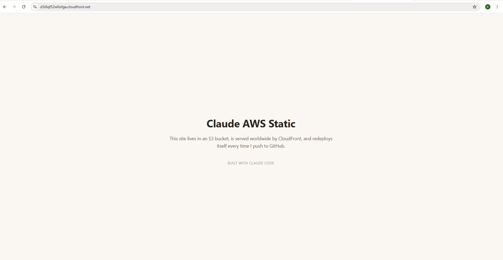
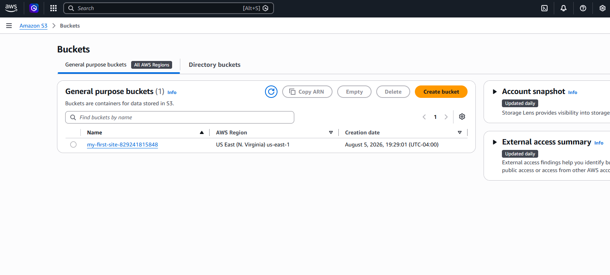

# my-first-site

A one-page personal site, deployed the modern way: a private S3 bucket served through CloudFront with Origin Access Control, auto-deployed by GitHub Actions on every push to `main` via OIDC (no stored AWS keys).

**Live:** https://d3i8qf52w0ofga.cloudfront.net

```
you edit → git push → GitHub Actions → S3 bucket (private) → CloudFront → the world
```

## Screenshots

**The live site**



**The S3 bucket backing it (private — CloudFront is the only thing allowed to read from it)**



## Stack

- **S3** — private bucket, blocks all public access
- **CloudFront** — CDN with Origin Access Control, HTTPS-only
- **GitHub Actions** — syncs to S3 and invalidates the CloudFront cache on every push to `main`
- **OIDC** — GitHub authenticates to AWS with a short-lived token via a tightly-scoped IAM role, no long-lived access keys involved

Built as part of [Claude Code × AWS](https://github.com/gkoufie1) — a course on shipping real AWS services with Claude Code.
